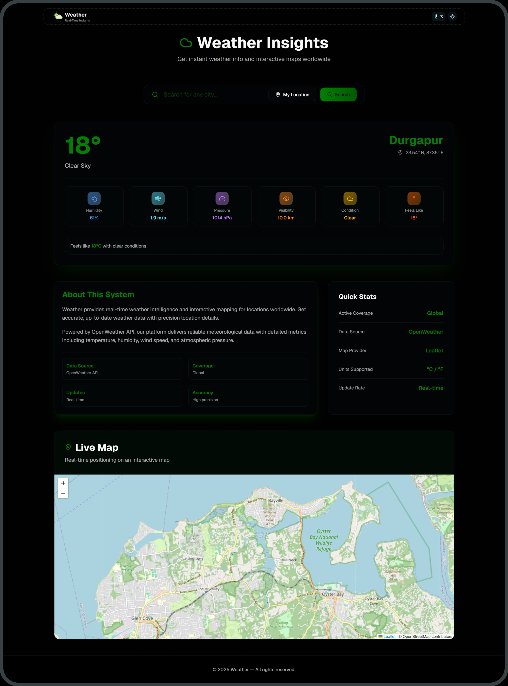
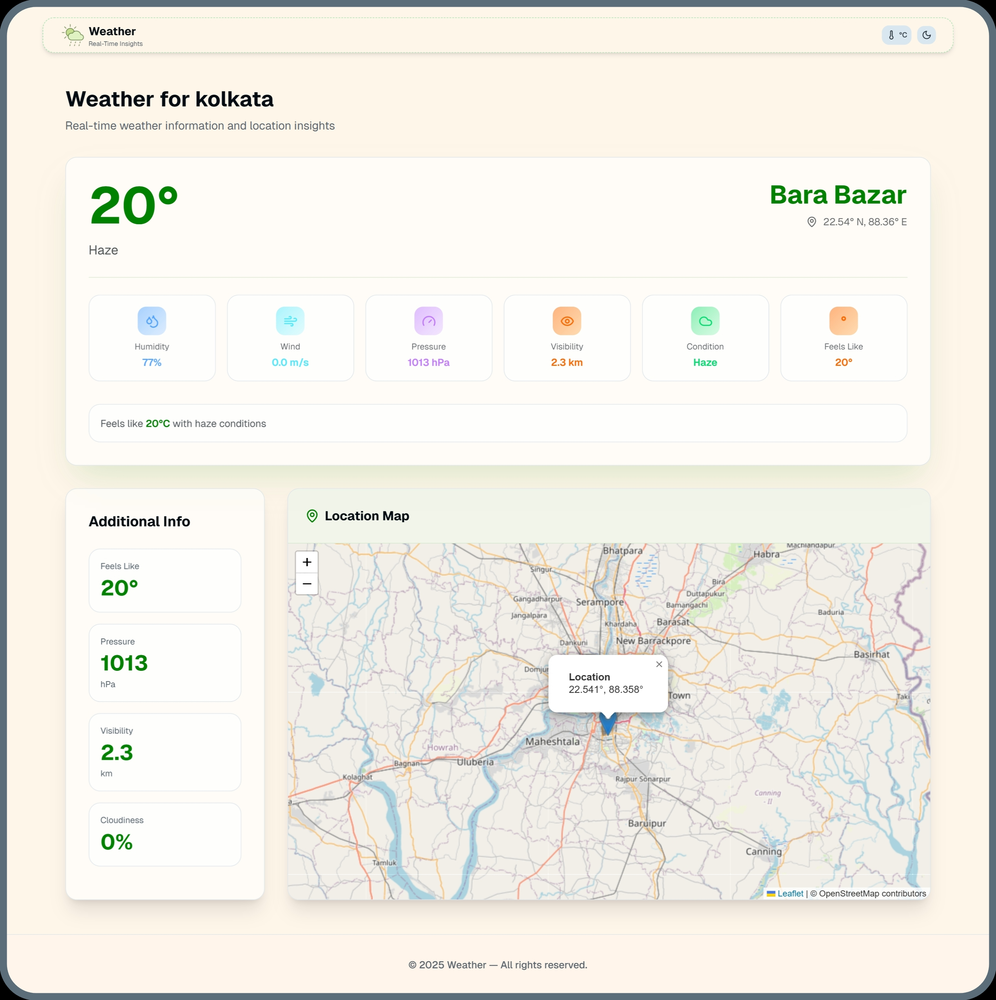

<div align="center" style="display: flex; align-items: center; justify-content: center;">
  
</div>

<div align="center">
  <h1><strong>WEATHER – Real-Time Insights</strong></h1>
</div>


---

## Live Demo

**Weather Website:** [https://weather.sujandas.info](https://weather.sujandas.info/)

---

## Preview

<div align="center">



<br/><br/>  <!-- Creates clean vertical gap -->



</div>

---


## Overview

**Weather** is a modern, real-time weather and mapping dashboard built using **Next.js**, **React**, **Tailwind CSS**, **OpenWeather API**, and **Leaflet Maps**.

It provides instant weather insights, auto-detects user location, displays geographic data, delivers search-based forecasts, and renders an interactive map for both current and searched locations.

---

## Key Features

* Automatic weather detection based on user’s location
* Clean and modern dashboard UI inspired by high-end SaaS design
* Search any city and view complete weather details
* Dedicated result page with structured data layout
* Interactive Leaflet Map showing real city positions
* Latitude and longitude display
* Responsive grid layout for all devices
* Clean and minimal card-based design
* Light/dark theme support using next-themes
* Fast data fetching through OpenWeather API
* Modular and scalable architecture

---

## Tech Stack

* Next.js (App Router)
* React
* Tailwind CSS
* OpenWeather API
* Leaflet.js
* react-leaflet
* next-themes

---

## Installation & Setup

```bash
# Clone the project
git clone https://github.com/devsujandas/weather.git
cd weather

# Install dependencies
npm install

# Start development server
npm run dev
```

Visit the project at:

```
http://localhost:3000
```

---

## Environment Variables

Create a `.env.local` file in the root directory:

```
NEXT_PUBLIC_WEATHER_KEY=YOUR_OPENWEATHER_API_KEY
```

Get your free API key from:
[https://openweathermap.org/api](https://openweathermap.org/api)

---

## Project Structure
```bash
weather/
├── app/
│   ├── globals.css
│   ├── layout.tsx
│   ├── loading.tsx
│   ├── page.tsx
│   │
│   └── weather/
│       ├── loading.tsx
│       └── page.tsx
│
├── components/
│   ├── Footer.tsx
│   ├── Header.tsx
│   ├── InfoCard.tsx
│   ├── LeafletMap.tsx
│   ├── MapComponent.tsx
│   ├── SearchBox.tsx
│   ├── temperature-context.tsx
│   ├── theme-provider.tsx
│   ├── ThemeToggle.tsx
│   └── WeatherCard.tsx
│
├── components/ui/
│   ├── button.tsx
│   ├── card.tsx
│   ├── input.tsx
│   ├── select.tsx
│   ├── dialog.tsx
│   ├── drawer.tsx
│   ├── carousel.tsx
│   ├── spinner.tsx
│   ├── tabs.tsx
│   ├── accordion.tsx
│   ├── badge.tsx
│   ├── avatar.tsx
│   ├── pagination.tsx
│   ├── form.tsx
│   ├── checkbox.tsx
│   ├── radio-group.tsx
│   ├── toast.tsx
│   ├── alert.tsx
│   ├── skeleton.tsx
│   └── [... other ui components]
│
├── hooks/
│   ├── use-mobile.ts
│   └── use-toast.ts
│
├── lib/
│   ├── utils.ts
│   ├── weather-api.ts
│   └── weather-colors.ts
│
├── public/
│   ├── images/
│   │   └── logo.png
│   └── [... other assets]
│
├── styles/
│   └── [... css modules or extra styles]
│
├── .env.local
├── .gitignore
├── components.json
├── next-env.d.ts
├── next.config.mjs
├── package-lock.json
├── package.json
├── pnpm-lock.yaml
├── postcss.config.mjs
└── tsconfig.json
```
---

## Home Page Features (Default Landing)

The homepage works as a full weather dashboard containing:

* Automatic location detection
* Weather information inside a single main card:

  * City Name
  * Latitude
  * Longitude
  * Temperature
  * Humidity
  * Wind Speed
  * Weather Condition
* About card with project description
* Demo Map card with a real Leaflet map
* Modern search bar
* Light/dark theme support
* Fully responsive grid layout

---

## Search Result Page (/weather?city=...)

Displays weather information for any searched city:

* City Name
* Temperature
* Humidity
* Wind Speed
* Latitude
* Longitude
* Weather Condition
* Detailed Grid Layout
* Full-width interactive Leaflet map

Map features:

* Live, real map
* Draggable and zoomable
* Marker with popup
* Uses OpenStreetMap tiles

---

## Deployment

Weather supports deployment on:

* Vercel (Recommended)
* Netlify
* Cloudflare Pages

Simply connect your GitHub repository and deploy.

---

## Builder

<div align="center">

[](https://github.com/devsujandas)
[](https://sujandas.info)
[](https://instagram.com/devsujandas)
[](https://linkedin.com/in/devsujandas)

</div>

<div align="center">
Thank you for exploring the Weather Dashboard.  
</div>
